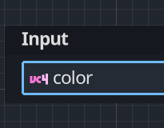

---
tags:
  - godot
  - youtube
---

<iframe width="560" height="315" src="https://www.youtube.com/embed/nyFzPaWAzeQ?si=yAzSy2mDjgKn1Hb1" title="YouTube video player" frameborder="0" allow="accelerometer; autoplay; clipboard-write; encrypted-media; gyroscope; picture-in-picture; web-share" allowfullscreen></iframe>

En el video nos muestra la referencia al lenguaje de shaders
https://docs.godotengine.org/en/stable/tutorials/shaders/shader_reference/shading_language.html

Partimos del hecho de que todo en [Godot](Godot/Godot%20Engine%20-%20Desarrollo%20de%20videojuegos.md) son "mesh". Es decir, triángulos. 
En gráficos rasterizados (pixel) lo que hace es tomar fragmentos de los pixeles. En lugar de trabajar con puntos, trabajamos con los fragmentos de los `pixeles`. 

## Programacion visual
No siempre es necesario programar el sharer, también es posible usar el editor visual de shaders, se llaman `VisualShaders`: 


Para entender un poco como funcionan los shaders, podemos pensar que se ejecuta todos los puntos al mismo tiempo, cada cálculo se hace en paralelo y no podemos tener refencias a como se ha calculado otro punto o como se calculó previamente. 

En el video se muestran algunos casos interesantes de cambios de colores y formas. 

Algunas notas sobre las entradas: 
- `vertex` indica la posición del punto. Esta es una posición visual. 
- `color` .... no te imaginas que modifica.


Ahora, en el ejemplo que se muestra explica que el centro del objeto `0,0` esta situado en el centro de la imagen y es la forma de calcular los vértices del objeto: 


La programacion de bloques se hace enlazando bloques con cables, en ocasiones no es demasiado intuitivo. 

Un detalle de los shaders es que hasta los ejes `x`,`y`  y `z` se muestran como `RGB`. 

Y que el icono de la izquierda indica que tipo de variable es. Este ejemplo es un vector de 4 elementos (`vec4`):


En el ejemplo con la animacion repite que no podemos almacenar variables entre ejecuciones, por lo que hay que buscar la manera de calcular el valor deseado en tiempo real. en este caso, para anumarlo usa la funcion `seno`, lo que queremos es mas o menos 
$$
f(t) = \sin (t)*100
$$
lo que amplia la amplitud del seno a 100. Si queremos ampliar o reducir la frecuencia (velocidad) tenemos que multiplicar el tiempo:

$$
f(t) = \sin\left(\frac{t}{2}\right)*100
$$

Esto lo tenemos que representar asi : 


## Usando código

En los shaders no podemos usar ciertas funciones normales en la programacion. En este caso en lugar de un `VisualShader` tenemos que escoger un `Shader`.

Dependiendo del lenguage puede variar la sintaxis del lenguaje de shaader, pero suele ser bastante similar.
```java
shader_type canvas_item;

void vertex() {
   if (VERTEX.y < 0.0) {
	   VERTEX += vec2(sin(TIME * 0.5) * 100.0, 0);
   }
}
```
Este codigo hace exactamente lo mismo que el codigo visual.

## Fragment shaders
En le video comenta otro tipo de shaders, los fragment.
Para eso comienza con un ejemplo de cambio de color.  De forma muy instructiva explica como crear una máscara de color y como aplicarla al dibujo para luego poder cambiarlo desde el juego. 

Una parte importante del codigo es la que permite pasarle parametros desde el codigo al shader: 
```gdscript
func _on_color_picker_color_changed(color):
	material.set_shader_parameter("replace_color",color)
```

El codigo final para hacer la máscara de colores :
```java
shader_type canvas_item;
uniform vec3 replacement_color: source_color;

void fragment() {
	vec3 color_without_green = COLOR.rgb * vec3(1,0,0);
	float amount_of_red_and_blue = length(color_without_green);
	float red_and_blue_mask = step(0.2,amount_of_red_and_blue);
	vec3 retain_color = COLOR.rgb * red_and_blue_mask;
	float green_mask = (1.0 - red_and_blue_mask )* COLOR.g;
	vec3 masked_replacement_color = replacement_color * green_mask;
	vec3 final_color = retain_color + masked_replacement_color;
	COLOR.rgb = final_color;
}

```

## Resumen
Un buen video para principiantes que explica los conceptos básicos de los shaders y permite empezar a usarlos para algunos proyectos.


