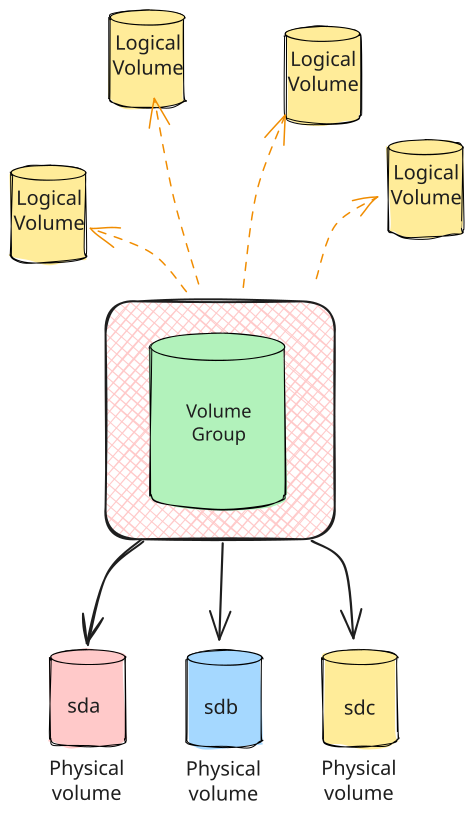

# 💾 LVM - Logical Volume Manager

El sistema de administración de volúmenes lógicos (LVM) es una herramienta fundamental para la gestión de almacenamiento en Linux que permite:

- ✅ Asignación flexible de discos
- ✅ Almacenamiento en banda (striping)
- ✅ Duplicación (mirroring)
- ✅ Redimensionamiento en caliente

## 📊 Esquema Conceptual



*Diagrama conceptual de la arquitectura LVM*

## 🔧 Niveles de LVM

| Nivel | Componente | Descripción |
|-------|------------|-------------|
| Físico | PV (Physical Volume) | Discos o particiones físicos |
| Grupo | VG (Volume Group) | Pool de almacenamiento combinado |
| Lógico | LV (Logical Volume) | Volúmenes utilizables por el sistema |

## 📁 Tipos de Configuración

### 1. Linear (Por Defecto)
Los datos se escriben secuencialmente a través de los PVs.

```bash
# Crear volumen lineal
lvcreate -L 10G -n lv_datos vg_principal
```

### 2. Striping (En Banda)
Los datos se distribuyen en bloques entre múltiples PVs para mejor rendimiento.

```bash
# Crear volumen stripeado con 2 discos
lvcreate -L 20G -i 2 -I 64K -n lv_stripeado vg_principal
```

### 3. Mirroring (Duplicación)
Réplica completa de datos para redundancia.

```bash
# Crear volumen espejado
lvcreate -L 10G -m1 -n lv_espejo vg_principal
```

## 🔗 Recursos Relacionados

- [[lvm-esquema-linear]] - Esquema detallado configuración linear
- [[lvm-esquema-en-banda]] - Esquema configuración striping
- [Red Hat LVM Administration](https://access.redhat.com/documentation/en-us/red_hat_enterprise_linux/8/html/configuring_and_managing_logical_volumes/)

---

> [!note] Nota
> Esta guía está basada en entornos Red Hat/CentOS pero es aplicable a la mayoría de distribuciones Linux que soportan LVM.

*¿Necesitas ayuda con un caso específico? Revisa la documentación oficial o los ejemplos detallados en los esquemas.*
