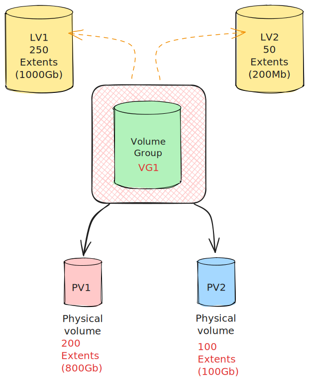

El sistema de administración de volúmenes lógicos (LVM) es una herramienta fundamental para la gestión de almacenamiento que permite la asignación de discos, el almacenamiento _"en banda"_ , franjas (striping), la duplicación (mirroring) y el redimensionamiento de volúmenes lógicos. 


En este contexto, es importante destacar que con LVM, un disco duro fisico o varios de discos duros se asignan a uno o más _volúmenes físicos_ (VP), los cuales, a su vez, pueden ubicarse en otros dispositivos de bloque, abarcando incluso dos o más discos. Esta guía tiene como objetivo proporcionar una visión general de cómo utilizar LVM generalmente en entornos Red Hat, aunque extensible a cualquier otra distribución de linux que soporte LVM.


### Enlaces de Referencia

Para una comprensión más profunda de la administración de volúmenes lógicos en sistemas Red Hat, se proporcionan los siguientes enlaces de referencia:

[Centos7](https://access.redhat.com/documentation/en-us/red_hat_enterprise_linux/7/html/logical_volume_manager_administration
/logical_volumes)
[Centos5](https://access.redhat.com/documentation/en-us/red_hat_enterprise_linux/5/html/deployment_guide/ch-lvm)

## Selección de Particiones o Discos Completos como Volúmenes Físicos

Uno de los principales aspectos que generan dudas está relacionado con la elección entre el uso de particiones o discos completos como volúmenes físicos. En este sentido, es esencial comprender que un grupo de volúmenes (_Volume Group_) puede contener varios volúmenes físicos. Cada volumen físico(_physical volume_), creado mediante "pvcreate", posee una etiqueta con un UUID único. Por defecto, la etiqueta LVM se ubica en el segundo sector de 512 bytes del dispositivo. Además, se almacena información sobre el tamaño del sector directamente en el volumen físico. Una copia idéntica de esta información también se almacena en el sistema operativo. Los respaldos y archivos de metadatos se crean automáticamente cada vez que se produce un cambio en la configuración de un grupo de volúmenes o volumen lógico, a menos que esta función se desactive en el archivo "lvm.conf".

De manera predeterminada, el respaldo de metadatos se almacena en el archivo "/etc/lvm/backup" y los archivos de metadatos se almacenan en el directorio "/etc/lvm/archive".


### Recomendación: Creación de una Partición Única para Discos Completos

Red Hat recomienda la creación de una única partición que cubra todo el disco para etiquetarlo como un volumen físico de LVM. Esto se recomienda por las siguientes razones:

- **Conveniencia Administrativa:** Es más sencillo realizar un seguimiento del hardware en un sistema si cada disco físico aparece solo una vez. Esta simplificación se vuelve especialmente valiosa en caso de fallos de disco. Además, tener múltiples volúmenes físicos en un solo disco puede generar advertencias del kernel relacionadas con tipos de particiones desconocidas durante el arranque.

- **Rendimiento de Almacenamiento en Banda (Strip performance):** LVM no puede determinar si dos volúmenes físicos (PV) se encuentran en el mismo disco físico. Si se crea un volumen lógico (LV) cuando dos volúmenes físicos están en el mismo disco físico, las bandas podrían estar en diferentes particiones en el mismo disco, lo que resultaría en una disminución del rendimiento en lugar de una mejora.


```console
# fdisk -l
...
/dev/sda6 318253056 956291071 319019008 8e Linux LVM

```
Además, una razón adicional para crear una partición única es informar a los programas de particionado de la existencia de algo en el disco. Evita situaciones problemáticas en las que un nuevo administrador de sistemas diagnostica un problema de arranque en un servidor, inicia un programa de particionado, observa discos no particionados y **concluye que el disco está corrupto**. Al no particionar el disco duro, no se establece explícitamente una identificación en el disco para indicar claramente su uso.

Es importante considerar estas recomendaciones al utilizar LVM en un entorno Red Hat para una administración de almacenamiento eficiente y sin problemas.

### Consideraciones Importantes

A continuación, se presentan algunas consideraciones cruciales relacionadas con el uso eficiente de LVM:

#### Creación de Particiones en Dispositivos de Arranque

Siempre es necesario crear particiones en dispositivos de arranque. Grub y LiLo no son compatibles con LVM, por lo que "/boot" debe estar fuera del disco de almacenamiento administrado por LVM.

#### Combinación de Volúmenes Físicos en Grupos de Volúmenes (VGs)

Los volúmenes físicos se combinan en grupos de volúmenes (Volume Groups, VGs). Esto crea un conjunto de espacio en disco del cual se pueden asignar volúmenes lógicos. Desde la perspectiva de Dell Compellent, es más sencillo recuperar un volumen de instantánea desde un solo volumen (como parte de un grupo de volúmenes) que desde varios. De lo contrario, los volúmenes de instantánea deben administrarse mediante comandos del sistema operativo para recuperar la información. Tenga esto en cuenta antes de agregar varios volúmenes físicos a un grupo de volúmenes; defina qué sistema de recuperación utilizará.

### Ventajas

En general, el proceso de recuperación será más sencillo si existen tablas de particiones.
Si intenta montar un volumen LVM sin tabla de particiones en Windows (por ejemplo, para recuperar datos), Windows no reconocerá el disco como válido y tratará de formatearlo, lo que resultaría en la pérdida de información.

Lo mismo puede ocurrir con un usuario administrador que se encuentre un error en el servidor y al utilizar herramientas de escaneo de disco le puede mostrar el mensaje de disco sin particiones. Lo que puede provocar confusión y considerar una avería en el disco. 

### Desventajas:

El redimensionamiento de volúmenes requiere recrear la tabla de particiones y realizar algunos pasos adicionales, lo que implica un mayor número de acciones. No es una tarea compleja pero implica más riesgo.


## Consideraciones sobre Volúmenes Lógicos

Dentro de un grupo de volúmenes, el espacio en disco disponible para la asignación se divide en unidades de un tamaño fijo denominadas "extensiones" (extents). Una extensión es la unidad más pequeña de espacio que se puede asignar. En un volumen físico, estas extensiones se denominan extensiones físicas (physical extends).

Un volumen lógico se asigna en extensiones lógicas del mismo tamaño que las extensiones físicas. El tamaño de la extensión es, por lo tanto, el mismo para todos los volúmenes lógicos en el grupo de volúmenes. El grupo de volúmenes (VG) asigna las extensiones lógicas a extensiones físicas.

Usando esta estructura, es posible tener diferentes tipos de volúmenes lógicos:

- Volumenes Lineales (Linear)
- En banda (Striped)
- Snapshots (literalmente, instantánea, por conveniencia no lo voy a traducir)
- Cache 

Los que realmente nos interesa son los dos primeros. 


### Volúmenes Lineales

Un volumen lineal agrupa espacio de uno o más volúmenes físicos en un solo volumen lógico. La creación de un volumen lineal asigna un rango de extensiones físicas a una zona de un volumen lógico para garantizar la continuidad del espacio.




#### Ventajas de los Volúmenes Lineales

Esta es una excelente manera de aumentar el tamaño del volumen cuando sea necesario. Sin embargo, generalmente es más sencillo recuperar un volumen de instantánea de un solo volumen (como parte de un grupo de volúmenes) que de varios. De lo contrario, los snapshot de los volumenes deben administrarse mediante comandos del sistema operativo para recuperar la información. Es fundamental tener en cuenta esta consideración antes de agregar varios volúmenes físicos a un grupo de volúmenes, y definir qué sistema de recuperación se utilizará.

Si el sistema de recuperacion de datos es externo al sistema de snapshot de volumenes, puede ser una opción muy interesante.

### Volúmenes Lógicos en Banda (Striped Logical Volumes)

Cuando se escribe datos en un volumen lógico de LVM, el sistema de archivos distribuye los datos en los volúmenes físicos subyacentes. Puede controlar la forma en que los datos se escriben en los volúmenes físicos creando un volumen lógico en banda (striped logical volume). Para lecturas y escrituras secuenciales grandes, esta configuración puede mejorar la eficiencia de la E/S de datos.


Esta configuración se debe considerar cuando se busca aumentar el rendimiento.


## Ventajas de Utilizar LVM

En general, el uso de LVM ofrece numerosas ventajas en comparación con el uso de almacenamiento físico directo. A lo largo de esta guía, exploraremos las mejores prácticas para aprovechar al máximo esta herramienta.


# HOW-TO 

En general estos comandos funcionan en cualquier distribucion que tenga instalado LVM
## Creación de un Nuevo Volumen Físico (PV)

Cuando desee crear un nuevo volumen físico, puede hacerlo utilizando un disco completo o una partición. La recomendación es crear primero una partición de disco. Aunque no es obligatorio para dispositivos de arranque, es una buena práctica. Para crear particiones en discos de menos de 2 TB, puede utilizar la herramienta `fdisk`. Para capacidades de disco más grandes, las distribuciones de RedHat proporcionan la aplicación `parted`.

Uso de `fdisk` para Crear una Nueva Partición de Tipo LVM:

```console
# fdisk /dev/sdb
Welcome to fdisk (util-linux 2.34).
Changes will remain in memory only, until you decide to write them.
Be careful before using the write command.

Device does not contain a recognized partition table.
Created a new DOS disklabel with disk identifier 0x7488fac7.

Command (m for help): n
Partition type
   p   primary (0 primary, 0 extended, 4 free)
   e   extended (container for logical partitions)
Select (default p): p
Partition number (1-4, default 1): 1
First sector (2048-20971519, default 2048):
Last sector, +/-sectors or +/-size{K,M,G,T,P} (2048-20971519, default 2048):

Using default value 20971519 
Partition 1 of type Linux and of size 10 GiB is set

Command (m for help): t
Selected partition 1
Hex code (type L to list all codes): L

 0  Empty           24  NEC DOS         81  Minix / old Lin bf  Solaris
 1  FAT12           27  Hidden NTFS Win 82  Linux swap / So c1  DRDOS/sec (FAT-
 2  XENIX root      39  Plan 9          83  Linux           c4  DRDOS/sec (FAT-
 3  XENIX usr       3c  PartitionMagic  84  OS/2 hidden or  c6  DRDOS/sec (FAT-
 4  FAT16 <32M      40  Venix 80286     85  Linux extended  c7  Syrinx
 5  Extended        41  PPC PReP Boot   86  NTFS volume set da  Non-FS data
 6  FAT16           42  SFS             87  NTFS volume set db  CP/M / CTOS / .
 7  HPFS/NTFS/exFAT 4d  QNX4.x          88  Linux plaintext de  Dell Utility
 8  AIX             4e  QNX4.x 2nd part 8e  Linux LVM       df  BootIt
 9  AIX bootable    4f  QNX4.x 3rd part 93  Amoeba          e1  DOS access
 a  OS/2 Boot Manag 50  OnTrack DM      94  Amoeba BBT      e3  DOS R/O
 b  W95 FAT32       51  OnTrack DM6 Aux 9f  BSD/OS          e4  SpeedStor
 c  W95 FAT32 (LBA) 52  CP/M            a0  IBM Thinkpad hi ea  Rufus alignment
 e  W95 FAT16 (LBA) 53  OnTrack DM6 Aux a5  FreeBSD         eb  BeOS fs
 f  W95 Ext'd (LBA) 54  OnTrackDM6      a6  OpenBSD         ee  GPT
10  OPUS            55  EZ-Drive        a7  NeXTSTEP        ef  EFI (FAT-12/16/
11  Hidden FAT12    56  Golden Bow      a8  Darwin UFS      f0  Linux/PA-RISC b
12  Compaq diagnost 5c  Priam Edisk     a9  NetBSD          f1  SpeedStor
14  Hidden FAT16 <3 61  SpeedStor       ab  Darwin boot     f4  SpeedStor
16  Hidden FAT16    63  GNU HURD or Sys af  HFS / HFS+      f2  DOS secondary
17  Hidden HPFS/NTF 64  Novell Netware  b7  BSDI fs         fb  VMware VMFS
18  AST SmartSleep  65  Novell Netware  b8  BSDI swap       fc  VMware VMKCORE
1b  Hidden W95 FAT3 70  DiskSecure Mult bb  Boot Wizard hid fd  Linux raid auto
1c  Hidden W95 FAT3 75  PC/IX           bc  Acronis FAT32 L fe  LANstep
1e  Hidden W95 FAT1 80  Old Minix       be  Solaris boot    ff  BBT
Hex code (type L to list all codes): 8e
Changed type of partition 'Linux' to 'Linux LVM'.

Command (m for help): w
The partition table has been altered.
Syncing disks.

```

Usando `parted`:
```console
# parted /dev/vdj
GNU Parted 2.1
Using /dev/vdj
Welcome to GNU Parted! Type 'help' to view a list of commands.
(parted) mklabel gpt
(parted) mkpart primary 0% 100%
(parted) print
Model: Virtio Block Device (virtblk)
Disk /dev/vdj: 3299GB
Sector size (logical/physical): 512B/512B
Partition Table: gpt
Number  Start   End     Size    File system  Name     Flags
 1      1049kB  3299GB  3299GB  primary

(parted) q

```


Agregar la Partición como Volumen Físico:

```console
# pvcreate /dev/sdb1
Physical volume "/dev/sdb1" successfully created

```
Crear un Grupo de Volúmenes (VG) y un Volumen Lógico (LV):

```console
# vgcreate vgDataName /dev/sdb1
Physical volume "/dev/sdb1" successfully created
Volume group "vgDataName" successfully created

# lvcreate -l +100%FREE -n lvData vgDataName
Logical volume "lvData" created.

```

Formatear el Volumen Lógico con ext4 o xfs:
```
# mkfs -t ext4 /dev/vgDataName/lvData
mke2fs 1.42.9 (28-Dec-2013)
Discarding device blocks: done
Filesystem label=
OS type: Linux
Block size=4096 (log=2)
Fragment size=4096 (log=2)
Stride=0 blocks, Stripe width=0 blocks
655360 inodes, 2620416 blocks
131020 blocks (5.00%) reserved for the super user
First data block=0
Maximum filesystem blocks=2151677952
80 block groups
32768 blocks per group, 32768 fragments per group
8192 inodes per group
Superblock backups stored on blocks: 32768, 98304, 163840, 229376, 294912, 819200, 884736, 1605632
Allocating group tables: done
Writing inode tables: done
Creating journal (32768 blocks): done
Writing superblocks and filesystem accounting information: done

# mount /dev/vgDataName/lvDataName /var/opt/data

```

Este proceso permite crear un nuevo volumen físico, un grupo de volúmenes y un volumen lógico en un sistema Linux utilizando comandos de consola.

## Incrementar el tamaño de un volumen logico

Podemos incrementar el tamaño de un volumen logico añadiendo un disco extra o, en entornos donde se pueda, incrementando el tamaño del disco (por ejemplo con maquinas virtuales).

Antes de comenzar siempre es recomendable hacer una copia de seguridad de los datos para evitar problemas. 

Obviaremos el proceso para incrementar el tamaño del disco o añadir un disco extra, puesto que depende del sistema. 

En el siguiente ejemplo podemos ver como esta el sistema antes del incremento de tamaño.

```
# lsblk
NAME                    MAJ:MIN RM  SIZE RO TYPE MOUNTPOINT
sda                       8:0    0   50G  0 disk
├─sda1                    8:1    0  500M  0 part /boot
└─sda2                    8:2    0 49.5G  0 part
  ├─vg_root-lvroot      253:0    0 45.6G  0 lvm  /
  └─vg_root-lvswap      253:1    0  3.9G  0 lvm  [SWAP]
sdb                       8:16   0    4T  0 disk
└─sdb1                    8:17   0    4T  0 part
  └─vg_data_1-lv_data_1 253:2    0    4T  0 lvm  /mnt/data01
```

Una vez incrementado el tamaño del disco (en este ejemplo de 4Tb a 5Tb)

```

# lsblk
NAME                    MAJ:MIN RM  SIZE RO TYPE MOUNTPOINT
sda                       8:0    0   50G  0 disk
├─sda1                    8:1    0  500M  0 part /boot
└─sda2                    8:2    0 49.5G  0 part
  ├─vg_root-lvroot      253:0    0 45.6G  0 lvm  /
  └─vg_root-lvswap      253:1    0  3.9G  0 lvm  [SWAP]
sdb                       8:16   0    5T  0 disk
└─sdb1                    8:17   0    4T  0 part
  └─vg_data_1-lv_data_1 253:2    0    4T  0 lvm  /mnt/data01
```


Ahora es necesario recrear la particion 1.  Por simplicidad vamos a usar `parted`, pero el procedimiento es similar con `fdisk`

```console

# parted /dev/sdb
GNU Parted 3.1
Using /dev/sdb
Welcome to GNU Parted! Type 'help' to view a list of commands.
(parted) print
Error: The backup GPT table is not at the end of the disk, as it should be.  This might mean that another operating system believes the disk is smaller.  Fix, by moving the backup to the end (and
removing the old backup)?
Fix/Ignore/Cancel? Fix
Warning: Not all of the space available to /dev/sdb appears to be used, you can fix the GPT to use all of the space (an extra 2147483648 blocks) or continue with the current setting?
Fix/Ignore? Fix
Model: QEMU QEMU HARDDISK (scsi)
Disk /dev/sdb: 5498GB
Sector size (logical/physical): 512B/512B
Partition Table: gpt
Disk Flags:
 
Number  Start   End     Size    File system  Name     Flags
 1      1049kB  4398GB  4398GB               primary
 
 
(parted) resizepart
Partition number? 1
End?  [4398GB]? 5498GB
(parted) print
Model: QEMU QEMU HARDDISK (scsi)
Disk /dev/sdb: 5498GB
Sector size (logical/physical): 512B/512B
Partition Table: gpt
Disk Flags:
 
Number  Start   End     Size    File system  Name     Flags
 1      1049kB  5498GB  5498GB               primary
 
(parted) q
Information: You may need to update /etc/fstab.
 
``` 


```console
# partx --show - /dev/sdb
NR START END SECTORS SIZE NAME UUID
1  2048 10737418206 10737416159   5T primary 0e0397d5-4b66-45d9-bd65-2c4a60268171
```

```console

# lsblk
NAME                    MAJ:MIN RM  SIZE RO TYPE MOUNTPOINT
sda                       8:0    0   50G  0 disk
├─sda1                    8:1    0  500M  0 part /boot
└─sda2                    8:2    0 49.5G  0 part
  ├─vg_root-lvroot      253:0    0 45.6G  0 lvm  /
  └─vg_root-lvswap      253:1    0  3.9G  0 lvm  [SWAP]
sdb                       8:16   0    5T  0 disk
└─sdb1                    8:17   0    5T  0 part
  └─vg_data_1-lv_data_1 253:2    0    4T  0 lvm  /mnt/data01
 
 
 
# pvresize /dev/sdb1
 Physical volume "/dev/sdb1" changed
 1 physical volume(s) resized / 0 physical volume(s) not resized
 
 
# lvextend -l +100%FREE /dev/vg_data_1/lv_data_1
  Size of logical volume vg_data_1/lv_data_1 changed from 4,00 TiB (1048564 extents) to 5,00 TiB (1310719 extents).
  Logical volume vg_data_1/lv_data_1 successfully resized
```

Ahora el resultado queda como esperamos, pero es necesario extender el sistema de ficheros.

En este caso se usa xfs :

```
# lsblk
NAME                    MAJ:MIN RM  SIZE RO TYPE MOUNTPOINT
sda                       8:0    0   50G  0 disk
├─sda1                    8:1    0  500M  0 part /boot
└─sda2                    8:2    0 49.5G  0 part
  ├─vg_root-lvroot      253:0    0 45.6G  0 lvm  /
  └─vg_root-lvswap      253:1    0  3.9G  0 lvm  [SWAP]
sdb                       8:16   0    5T  0 disk
└─sdb1                    8:17   0    5T  0 part
  └─vg_data_1-lv_data_1 253:2    0    5T  0 lvm  /mnt/data01
 
# xfs_growfs /dev/vg_data_1/lv_data_1
meta-data=/dev/mapper/vg_data_1-lv_data_1 isize=512    agcount=6, agsize=201326336 blks
         =                       sectsz=512   attr=2, projid32bit=1
         =                       crc=1        finobt=0 spinodes=0
data     =                       bsize=4096   blocks=1073729536, imaxpct=5
         =                       sunit=0      swidth=0 blks
naming   =version 2              bsize=4096   ascii-ci=0 ftype=1
log      =internal               bsize=4096   blocks=393215, version=2
         =                       sectsz=512   sunit=0 blks, lazy-count=1
realtime =none                   extsz=4096   blocks=0, rtextents=0
data blocks changed from 1073729536 to 1342176256
```

El tamaño se muestra correctamente.

```
 
# df -h
Filesystem                       Size  Used Avail Use% Mounted on
/dev/mapper/vg_root-lvroot        46G  1.2G   45G   3% /
devtmpfs                         1.9G     0  1.9G   0% /dev
tmpfs                            1.9G     0  1.9G   0% /dev/shm
tmpfs                            1.9G  8.5M  1.9G   1% /run
tmpfs                            1.9G     0  1.9G   0% /sys/fs/cgroup
/dev/sda1                        497M   89M  408M  18% /boot
/dev/mapper/vg_data_1-lv_data_1  5.0T  1.9G  5.0T   1% /mnt/data01
tmpfs                            380M     0  380M   0% /run/user/1335757945
```

### Añadir un disco extra al grupo de volumenes
Asumimos que ya tienes el disco nuevo disponible. Este aparece listado como uno nuevo (vdc):

```

# lsblk
NAME                       MAJ:MIN RM  SIZE RO TYPE MOUNTPOINT
vda                        252:0    0   12G  0 disk
├─vda1                     252:1    0  500M  0 part /boot
└─vda2                     252:2    0 11.5G  0 part
  ├─vg00-lv_root (dm-0)    253:0    0 10.3G  0 lvm  /
  └─vg00-lv_swap (dm-1)    253:1    0  1.2G  0 lvm  [SWAP]
vdb                        252:16   0   70G  0 disk
└─vdb1                     252:17   0   70G  0 part
  └─vg_data-lv_data (dm-2) 253:2    0   70G  0 lvm  /mnt
vdc                        252:32   0   10G  0 disk
 
```

Podemos comprobar las particiones: 
```console

# cat /proc/partitions
major minor  #blocks  name
 
 252        0   12582912 vda
 252        1     512000 vda1
 252        2   12069888 vda2
 252       16   73400320 vdb
 252       17   73398272 vdb1
 252       32   10485760 vdc
 253        0   10809344 dm-0
 253        1    1257472 dm-1
 253        2   73396224 dm-2
``` 

Hacemos una nueva particion del nuevo disco.
```console
# parted /dev/vdc
GNU Parted 2.1
Using /dev/vdc
Welcome to GNU Parted! Type 'help' to view a list of commands.
 
                                                                           
(parted) mklabel gpt
 
                                                                           
(parted) mkpart primary 0&% 100%
 
                                                                           
(parted) print
Model: Virtio Block Device (virtblk)
Disk /dev/vdc: 10.7GB
Sector size (logical/physical): 512B/512B
Partition Table: gpt
 
Number  Start   End     Size    File system  Name     Flags
 1      1049kB  10.7GB  10.7GB               primary
 
 
                                                                           
(parted) q
```

Podemos confirma el estado 

```console

# lsblk
NAME                       MAJ:MIN RM  SIZE RO TYPE MOUNTPOINT
vda                        252:0    0   12G  0 disk
├─vda1                     252:1    0  500M  0 part /boot
└─vda2                     252:2    0 11.5G  0 part
  ├─vg00-lv_root (dm-0)    253:0    0 10.3G  0 lvm  /
  └─vg00-lv_swap (dm-1)    253:1    0  1.2G  0 lvm  [SWAP]
vdb                        252:16   0   70G  0 disk
└─vdb1                     252:17   0   70G  0 part
  └─vg_data-lv_data (dm-2) 253:2    0   70G  0 lvm  /mnt
vdc                        252:32   0   10G  0 disk
└─vdc1                     252:33   0   10G  0 part
 
```

Indicamos que la nueva particion está lista para ser parte del grupo  y hacemos el mismo proceso. 

```console

#  pvcreate /dev/vdc1
  Physical volume "/dev/vdc1" successfully created
 

# vgextend vg_data /dev/vdc1
  Volume group "vg_data" successfully extended
 
# vgs
  VG      #PV #LV #SN Attr   VSize  VFree
  vg00      1   2   0 wz--n- 11.51g     0
  vg_data   2   1   0 wz--n- 79.99g 10.00g
 
# pvs
  PV         VG      Fmt  Attr PSize  PFree
  /dev/vda2  vg00    lvm2 a--u 11.51g     0
  /dev/vdb1  vg_data lvm2 a--u 70.00g     0
  /dev/vdc1  vg_data lvm2 a--u 10.00g 10.00g
 
#  lvresize -L 79.99g /dev/mapper/vg_data-lv_data
  Rounding size to boundary between physical extents: 79.99 GiB.
  Size of logical volume vg_data/lv_data changed from 70.00 GiB (17919 extents) to 79.99 GiB (20478 extents).
  Logical volume lv_data successfully resized.
 
# xfs_growfs /dev/mapper/vg_data-lv_data
meta-data=/dev/mapper/vg_data-lv_data isize=256    agcount=4, agsize=4587264 blks
         =                       sectsz=512   attr=2, projid32bit=0
data     =                       bsize=4096   blocks=18349056, imaxpct=25
         =                       sunit=0      swidth=0 blks
naming   =version 2              bsize=4096   ascii-ci=0
log      =internal               bsize=4096   blocks=8959, version=2
         =                       sectsz=512   sunit=0 blks, lazy-count=1
realtime =none                   extsz=4096   blocks=0, rtextents=0
data blocks changed from 18349056 to 20969472
 
# df -h
Filesystem            Size  Used Avail Use% Mounted on
/dev/mapper/vg00-lv_root
                       11G  928M  8.7G  10% /
tmpfs                 1.9G     0  1.9G   0% /dev/shm
/dev/vda1             477M   37M  416M   9% /boot
/dev/mapper/vg_data-lv_data
                       80G  333M   80G   1% /mnt
# lsblk
NAME                       MAJ:MIN RM  SIZE RO TYPE MOUNTPOINT
vda                        252:0    0   12G  0 disk
├─vda1                     252:1    0  500M  0 part /boot
└─vda2                     252:2    0 11.5G  0 part
  ├─vg00-lv_root (dm-0)    253:0    0 10.3G  0 lvm  /
  └─vg00-lv_swap (dm-1)    253:1    0  1.2G  0 lvm  [SWAP]
vdb                        252:16   0   70G  0 disk
└─vdb1                     252:17   0   70G  0 part
  └─vg_data-lv_data (dm-2) 253:2    0   80G  0 lvm  /mnt
vdc                        252:32   0   10G  0 disk
└─vdc1                     252:33   0   10G  0 part
  └─vg_data-lv_data (dm-2) 253:2    0   80G  0 lvm  /mnt

```

