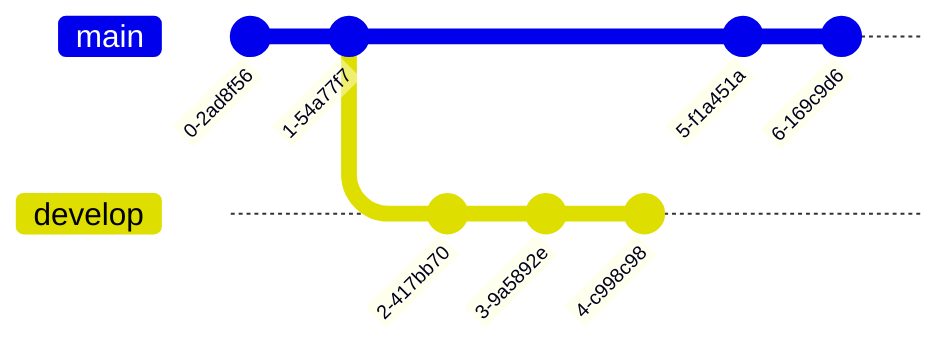
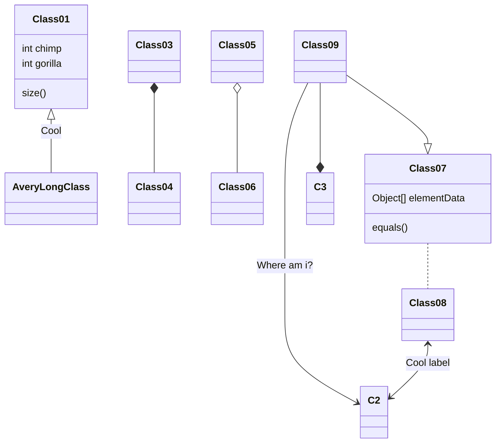
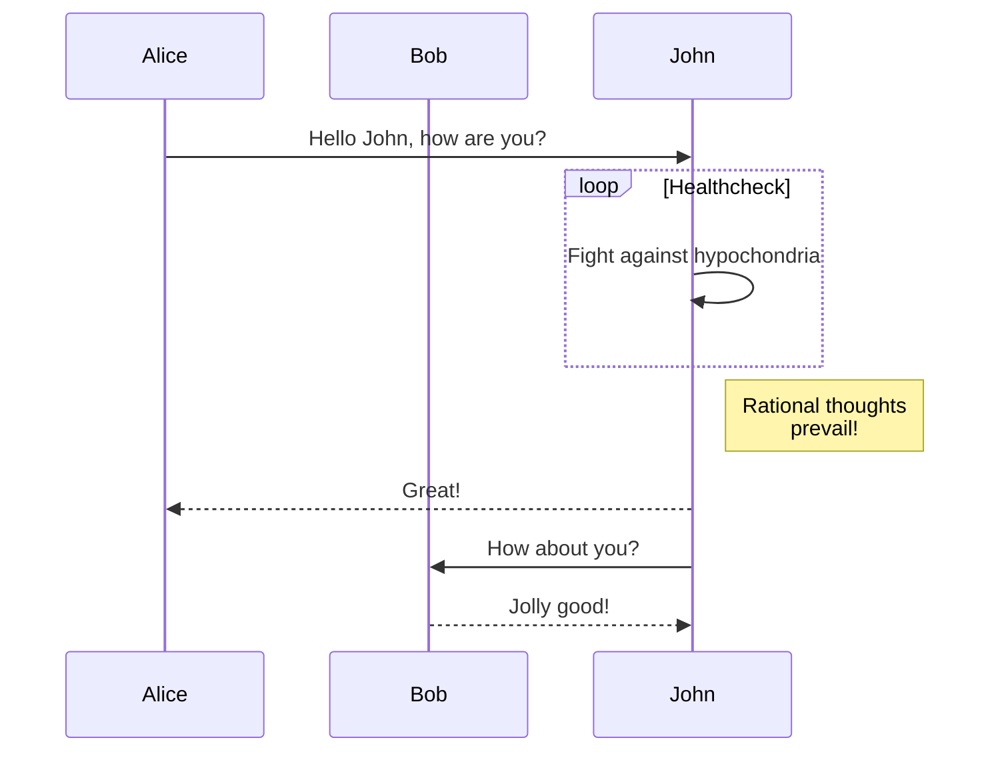
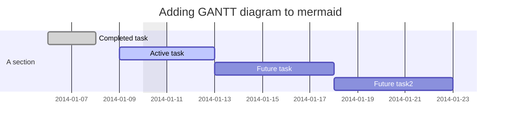

# 🧪- Página de Pruebas 🧪
Esto es un fichero de pruebas a ver como funcionan las carpetas.

```console
$ obsidianhtml convert -i .\config.yaml
$ obsidianhtml serve --directory output/html --port 8000

```


Con el fichero de configuración : 

```yaml

obsidian_entrypoint_path_str: 'c:/users/eferosa/OneDrive - Ericsson/notas/Agenda/Reuniones/2023/2023-10-03 14_09 Reunión.md'
obsidian_folder_path_str: 'c:/users/eferosa/OneDrive - Ericsson/notas'

```

Ahora, usando obsidian como editor y obsidianhtml puedo tener mi sitio en github con una action como esta: 

```yaml
# Simple workflow for deploying static content to GitHub Pages
name: Deploy static content to Pages

on:
  # Runs on pushes targeting the default branch
  push:
    branches: ["master"]
  # Allows you to run this workflow manually from the Actions tab
  workflow_dispatch:

# Sets permissions of the GITHUB_TOKEN to allow deployment to GitHub Pages
permissions:
  contents: read
  pages: write
  id-token: write

# Allow only one concurrent deployment, skipping runs queued between the run in-progress and latest queued.
# However, do NOT cancel in-progress runs as we want to allow these production deployments to complete.
concurrency:
  group: "pages"
  cancel-in-progress: false

jobs:
  deploy:
    environment:
      name: github-pages
      url: ${{ steps.deployment.outputs.page_url }}
    runs-on: ubuntu-latest
    steps:
      - name: Checkout
        uses: actions/checkout@v3
      - name: Install dependencies and run build
        run: |
          cd ${{ github.workspace }}
          ls -la
          pip install --upgrade pip
          pip install obsidianhtml==3.5.2
          pwd
          obsidianhtml convert -v
          touch html/.nojekyll
          mv assets/* html/assets/
      - name: Upload artifact
        uses: actions/upload-pages-artifact@v2
        with:
          path: 'html'
      - name: Deploy to GitHub Pages
        id: deployment
        uses: actions/deploy-pages@v2

```

Con las ventajas de editar en markdown y obsdian
## Latex

$$
\begin
{vmatrix}a & b \\ c & d
\end
{vmatrix}=ad-bc
$$

Hasta simplemente usar $\pi$ o  $\omega$ en una línea.

## Mermaid

No soy muy fan de [mermaid](https://mermaid.js.org/), pero puede ser util :








